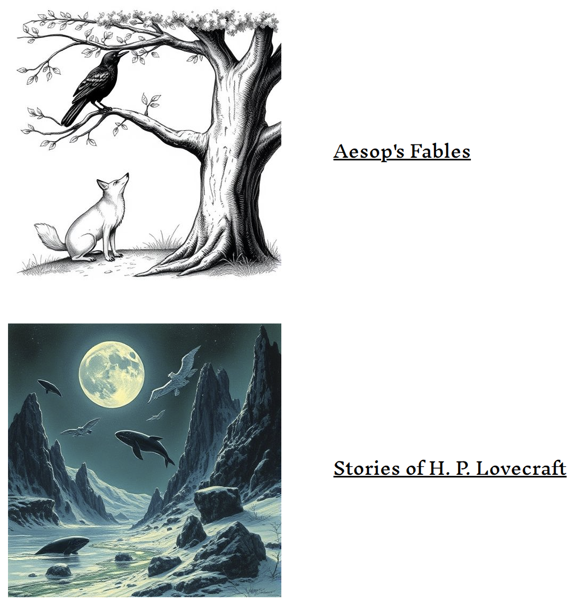

# Applicators

## RAG

- [Aesop_query.html](Aesop_query.html) show how to use the chunk database obtained with [extract_Aesop.ipynb](/extractors/extract_Aesop.ipynb),
  and [split_Aesop.ipynb](/processors/split_Aesop.ipynb).
  It is a simple search for best matches using the cosine similarity.
- [Lovecraft_query.html](Lovecraft_query.html) show how to use the chunk database obtained with [extract_Lovecraft.ipynb](/extractors/extract_Lovecraft.ipynb),
  and [split_Lovecraft.ipynb](/processors/split_Lovecraft.ipynb).
  It is a simple search for best matches using the cosine similarity.

For a more complete example implementation of both of the above, with image generation, visit https://rag.monodromy.group/aesop/

